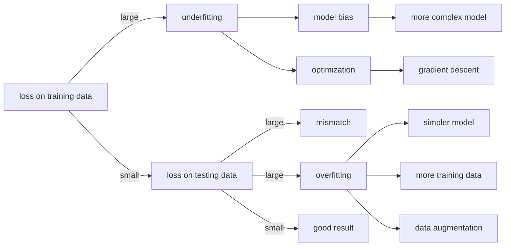
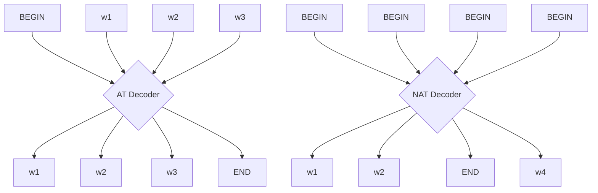
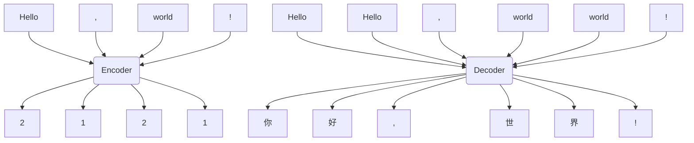

> This article was migrated from [Eureka10shen on 博客园]({{ page.original_url }}). The original publication date was 2022-09-15.
# Machine Learning
2022春机器学习，国立台湾大学，李宏毅

---
---
# 1 Introduction of Deep Learning

## 1.1 Machine Learning Intro
machine learning --> looking for function (so complex that cannot be written manually)  

__** different types of functions **__  
regression : the function outputs a scalar  
classification : the function outputs correct options (classes)  
structured learning : create something with structure (image, document)

__** how to find the function **__  
model --> loss --> optimization  
__batch__ : divide samples into batchs, compute loss for one batch to compute gradients and update parameters for one optimization  
__epoch__ : trained all batchs

## 1.2 Deep Learning
__** backpropagation **__  
for a fully-connected multi-layer perceptron, the $i$th layers behaves

$$

y^{(i)}_k = \sigma\left(\sum_j w_{k,j}^{(i)} x_j^{(i)} + b_k^{(i)}\right)

$$

where $\sigma(z)$ is the __activation function__, $i$ denotes __layer index__, $k$ denotes __feature index__  
considering the L2 loss function  

$$

L(\textbf{W},\textbf{b}) = \frac{1}{n} \left(\sum_{k=1}^n \frac{1}{2} \left(\hat{y}_k^{(m)}-y_k^{(m)}\right)^2\right)

$$

where $n$ is the number of output features, $m$ is the number of layers  
the backpropagation behaves  

$$

\frac{\partial L}{\partial w_{k,j}^{(m)}} = (y_k^{(m)}-\hat{y}_k^{(m)}) \frac{\partial \sigma(z)}{\partial z} y^{(m-1)}_{j}

$$

$$

\frac{\partial L}{\partial b_k^{(m)}} = (y_k^{(m)}-\hat{y}_k^{(m)}) \frac{\partial \sigma(z)}{\partial z}

$$

$$

\frac{\partial L}{\partial w_{k,j}^{(i)}} = \frac{1}{2n} \sum_{j=1}^n \frac{\partial \left(\hat{y}_j^{(m)}-y_j^{(m)}\right)^2}{\partial y^{(i)}_{k}} \frac{\partial \sigma(z)}{\partial z} y^{(i-1)}_{j}

$$

$$

\frac{\partial \left(\hat{y}_j^{(m)}-y_j^{(m)}\right)^2}{\partial y^{(i)}_{k}} 
= \sum_s \frac{\partial \left(\hat{y}_j^{(m)}-y_j^{(m)}\right)^2}{\partial y^{(i+1)}_{s}} \frac{\partial y^{(i+1)}_{s}}{\partial y^{(i)}_{k}} 
= \sum_s \frac{\partial \left(\hat{y}_j^{(m)}-y_j^{(m)}\right)^2}{\partial y^{(i+1)}_{s}} \frac{\partial \sigma(z)}{\partial z} w_{s,k}^{(i+1)}

$$

$$

\frac{\partial \left(\hat{y}_j^{(m)}-y_j^{(m)}\right)^2}{\partial y^{(i)}_{k}} \leftarrow 
\frac{\partial \left(\hat{y}_j^{(m)}-y_j^{(m)}\right)^2}{\partial y^{(i+1)}_{k}} \leftarrow ... \leftarrow 
\frac{\partial \left(\hat{y}_j^{(m)}-y_j^{(m)}\right)^2}{\partial y^{(m)}_{k}}

$$

$$

\frac{\partial L}{\partial b_{k}^{(i)}} = \frac{1}{2n} \sum_{j=1}^n \frac{\partial \left(\hat{y}_j^{(m)}-y_j^{(m)}\right)^2}{\partial y^{(i)}_{k}} \frac{\partial \sigma(z)}{\partial z}

$$

then gradient descent behaves

$$

\theta^{(\text{new})} \leftarrow \theta^{(\text{old})} - \eta \left. \frac{\partial L}{\partial \theta} \right|_{\theta^{(old)}}

$$

## 1.3 Regression
__** linear model **__  
model function :

$$

y_i = \sum_{j=1}^n w_{ij} x_j + b_j

$$

where $n$ is the number of input feature  
loss function :

$$

L(\mathbf{W}, \mathbf{b}) = \frac{1}{N} \sum_{i=1}^N \frac{1}{2} \left[\hat{y}_i - \left(\sum_{j=1}^n w_{ij} x_j + b_j\right)\right]^2

$$

  
where $N$ is the number of output feature  
optimization : 

$$

\mathbf{w}^*,b^* = \arg \min_{\mathbf{w},b}L(\mathbf{w},b)

$$

__** model selection **__  
polynomial model for Pokemon CP --> higher order polynomial, more complex model, less _training loss_ --> _testing loss_ decreases when lower than 3 order, _testing loss_ increases when higher than 3 order --> __overfitting__ from complex model

## 1.4 Classification
__** ideal model for binary classification **__  
model:

$$

f(x) =
\begin{cases}
g(x)>0, & \text{if output = class 1}, \\
\text{else}, & \text{if output = class 2}.
\end{cases}

$$

loss : $L(f) = \sum_ {i}\delta(f(x_ {i}) \ne \hat{y}_ {i})$

__** probabilistic generative model **__  
for a __binary classification__, given an $x$, the probability that it belongs to $C_ {1}$ is

$$

P(C_1|x) = \frac{P(x|C_1) P(C_1)}{P(x|C_1) P(C_1) + P(x|C_2) P(C_2)}

$$

generative model : $P(x) = P(x\vert C_ {1})P(C_ {1}) + P(x\vert C_ {2})P(C_ {2})$  
assume that the dataset is sampled from a Gaussian distribution

$$

f_{\mu,\Sigma}(x) = \frac{1}{(2\pi) ^ {D/2}} \frac{1}{|\Sigma| ^ {1/2}} \exp{\left[-\frac{1}{2} (x-\mu)^\top \Sigma^{-1} (x-\mu)\right]}

$$

how to find the Gaussian distrtibution --> maximum likelihood

$$

\mu^*,\Sigma^* = \arg \max_{\mu,\Sigma} \prod_{i=1}^N f_{\mu,\Sigma}(x_i)

$$

where $N$ is the __sample number__, and we can get that

$$

\mu^* = \frac{1}{N}\sum_{i=1}^Nx_i, \Sigma^* = \frac{1}{N^2}\sum_{i=1}^N(x_i-\mu^*)(x_i-\mu^*)^\top

$$

we have 

$$

P(x|C_k) = f_{\mu_k,\Sigma_k}(x), P(C_k) = \frac{n_{C_k}}{n_{\text{total}}}

$$

The model assigns class 1 when the posterior probability $P(C_ {1}\vert x)$ exceeds 0.5; otherwise it assigns class 2.

## 1.5 Logistic Regression
revisite the probalisitic generative model, we have  

$$

P(C_1|x) = \frac{f_{\mu_1,\Sigma_1}(x) n_{C_1}}{f_{\mu_1,\Sigma_1}(x) n_{C_1} + f_{\mu_2,\Sigma_2}(x) n_{C_2}} = \frac{1}{1 + \frac{f_{\mu_2,\Sigma_2}(x) n_{C_2}}{f_{\mu_1,\Sigma_1}(x) n_{C_1}}}

$$

let

$$

z = \ln \frac{f_{\mu_1,\Sigma_1}(x) n_{C_1}}{f_{\mu_2,\Sigma_2}(x) n_{C_2}}

$$

we have the __sigmoid function__

$$

P(C_1|x) = \frac{1}{1 + \exp{(-z)}} = \sigma(z)

$$

considering the new variable

$$

z = \ln \frac{e^{-\frac{1}{2} (x-\mu_1)^\top \Sigma_1^{-1} (x-\mu_1)}}{e^{-\frac{1}{2} (x-\mu_2)^\top \Sigma_2^{-1} (x-\mu_2)}} + \ln \frac{|\Sigma_2| ^ {1/2}}{|\Sigma_1| ^ {1/2}} + \ln \frac{n_{C_1}}{n_{C_2}}

$$

usually $\Sigma_ {1}$ and $\Sigma_ {2}$ are assumed to be the same and we have  

$$

\begin{align*}
z & = -\frac{1}{2} [(x-\mu_1)^\top \Sigma_1^{-1} (x-\mu_1) - (x-\mu_2)^\top \Sigma_2^{-1} (x-\mu_2)] + \ln \frac{n_{C_1}}{n_{C_2}} \\
& = -\frac{1}{2} [2\mu_2^\top \Sigma_2^{-1} x - 2\mu_1^\top \Sigma_1^{-1} x + \mu_1^\top \Sigma_1^{-1} \mu_1 - \mu_2^\top \Sigma_2^{-1} \mu_2] + \ln \frac{n_{C_1}}{n_{C_2}} \\
& = -(\mu_2^\top - \mu_1^\top)\Sigma^{-1} x -\frac{1}{2}[\mu_1^\top \Sigma^{-1} \mu_1 - \mu_2^\top \Sigma^{-1} \mu_2] + \ln \frac{n_{C_1}}{n_{C_2}} \\
& = W^\top x + b
\end{align*}

$$

then we can get the logistic regression model : 

$$

f_{w,b}(x) = \sigma(\sum_i w_i x_i + b)

$$

  
Assume that the classifier output is the posterior probability $P_ {w,b}(C_ {1}\vert x)$; the loss is

$$

L(w,b) = \prod_{s=1}^mf_{w,b}(x^s|x^s\in C_1) \prod_{t=1}^{N-m}(1-f_{w,b}(x^t|x^t\in C_2))

$$

optimization : 

$$

w^*,b^* = \arg \max_{w,b} L(\mathbf{w},b) = \arg \min_{w,b} \left(-\ln L(w,b)\right) \\ 
=\arg \min_{w,b} -\ln\left[\sum_{s=1}^mf_{w,b}(x^s|x^s\in C_1) + \sum_{t=1}^{N-m}(1-f_{w,b}(x^t|x^t\in C_2))\right]

$$

Set the target label to 1 for class $C_ {1}$ and to 0 for class $C_ {2}$; then

$$

-\ln l(x^s) = -\left[\hat{y}^s\ln f(x^s) + (1-\hat{y}^s)\ln(1-f(x^s))\right]

$$

the loss function becomes

$$

-\ln L(w,b) = \sum_{s=1}^N -\left[\hat{y}^s \ln f_{w,b}(x^s) + (1-\hat{y}^s)\ln (1 - f_{w,b}(x^s))\right]

$$

where the summed term is the cross entropy of two _Bernoulli distributions_

$$

p(z) = \begin{cases}
    \hat{y}^s, & z=1 \\
    1-\hat{y}^s, & z=0 
\end{cases}

$$

$$

q(z) = \begin{cases}
    f(x^s), & z=1 \\
    1-f(x^s), & z=0 
\end{cases}

$$

$$

H(p,q) = -\sum_z p(z)\ln q(z)

$$

gradient descent : 

$$

\frac{\partial \ln f_{w,b}(x)}{\partial w_i} = \frac{\partial \ln f_{w,b}(x)}{\partial z} \frac{\partial z}{\partial w_i} = \frac{\partial \ln \sigma(z)}{\partial z} \frac{\partial z}{\partial w_i} = (1-\sigma(z))x_i

$$

 

$$

\frac{\partial \ln (1-f_{w,b}(x))}{\partial w_i} = \frac{\partial \ln (1-\sigma(z))}{\partial z} \frac{\partial z}{\partial w_i} = -\sigma(z)x_i

$$

$$

\begin{align*}
-\frac{\partial \ln L(w,b)}{\partial w_i} & = \sum_{s=1}^N -\left[\hat{y}^s(1-f(x^s))x^s_i - (1-\hat{y}^s)f(x^s)x^s_i\right] \\ 
& = \sum_{s=1}^N -\left[\hat{y}^ix^s_i - \hat{y}^sf(x^s)x^s_i - f(x^s)x^s_i + \hat{y}^sf(x^s)x^s_i\right] \\ 
& = \sum_{s=1}^N -\left(\hat{y}^s - f(x^s)\right)x^s_i
\end{align*}

$$

__Question__ : why cross entropy rather than L2 loss ?  
for L2 loss, we have

$$

\begin{align*}
-\frac{\partial \ln L(w,b)}{\partial w_i} & = \sum_{s=1}^N (\hat{y}^s - f(x^s))\frac{\partial f_{w,b}(x)}{\partial z} \frac{\partial z}{\partial w_i} \\ 
& = \sum_{s=1}^N (\hat{y}^s - f(x^s))f(x^s)(1-f(x^s))x^s_i
\end{align*}

$$

if $\hat{y}^s=1$, $f(x^s)=1$, gradient descent will be slow  
if $\hat{y}^s=1$, $f(x^s)=0$, gradient descent will also be slow (originating from sigmoid function)

---
---
# 2 What to do if My Network Fails to Train

## 2.1 Machine Learning Strategy

considering optimization : deeper network behaves worse than shallower network  
__model constraint__ for overfitting : less parameter; less feature; early stopping; regularization; dropout; n-fold cross validation; ...  
__mismatch__ : training data and testing data are not in the same distribution

## 2.2 Optimization Strategy 1 -- Critical Points
For a loss function $L(\theta)$, we have the Taylor expansion at $\theta=\theta'$

$$

L(\theta) \approx L(\theta') + (\theta-\theta')^\top g + \frac{1}{2}(\theta-\theta') H (\theta-\theta')^\top

$$

where $g$ is the gradient, which equals to zero at critical points

$$

g_i = \frac{\partial L(\theta')}{\partial \theta_i}

$$

and $H$ is the Hassian matrix

$$

H_{ij} = \frac{\partial^2 L(\theta')}{\partial\theta_i \partial\theta_j}

$$

at critical point, we have  

| class | for all $(\theta-\theta')$   $(\theta-\theta') H (\theta-\theta')^\top$ | eigenvalues of $H$ |
| :----------: | :-------: | :----------: |
| local maxima | $<0$      | all negative |
| local minima | $>0$      | all positive |
| saddle point | $>0$ and $<0$ | positive and negative |  

_Comments_ : saddle points are much more frequently encountered than local minima in high dimensional space

## 2.3 Optimization Strategy 2 -- Batch, Momentum and Learning Rate
__** optimization with batch **__  
bigger batch size optimizes faster, smaller batch size has better performance  

__** momentum **__  
movement --> movement of last step minus gradient at present

$$

\mathbf{m}^{(i+1)} = \lambda \mathbf{m}^{(i)} - \eta \mathbf{g}^{(i)}

$$

__** learning rate **__  
parameter dependent learning rate  

$$

\theta_i^{(t+1)} = \theta_i^{(t)} - \frac{\eta}{\sigma_i^{(t)}} g_i^{(t)}

$$

(1) __Adagrad__ --> root mean square parameter  

$$

\sigma_i^{(t)} = \sqrt{\frac{1}{t+1} \sum_{j=0}^t \left|g_i^{(j)}\right|^2}

$$

(2) __RMSProp__ --> depend on previous parameter (__Adam__ --> __RMSProp__ + momentum)  

$$

\sigma_i^{(t)} = \sqrt{\alpha\sigma_i^{(t-1)} + (1-\alpha)\left|g_i^{(t)}\right|^2}

$$

__** learning rate scheduling **__  

$$

\theta_i^{(t+1)} = \theta_i^{(t)} - \frac{\eta(\text{time})}{\sigma_i^{(t)}} g_i^{(t)}

$$

(1) learning rate decay --> decay with time  

$$

\eta(t) = ae^{-bt}

$$

(2) warm up --> increase and then decrease (at the beginning, the estimate of $\sigma_ {i}^{(t)}$ has large variance)  

$$

\eta(\text{step}) = a \cdot \min(\text{step}^b, \text{step}^{-c})

$$

## 2.4 Optimization Strategy 3 -- Batch Normalization
for smaples in a batch ${\mathbf{x}^1, \mathbf{x}^2, ..., \mathbf{x}^N}$, and $\mathbf{x}^i = [x_ {1}^i, x_ {2}^i, ..., x_ {m}^i]^\top$, normalize features in the sample as  

$$

\tilde{x}_j^i = \frac{x_j^i-\mu_j}{\sigma_j}

$$

where  

$$

\mu_j = \frac{1}{N} \sum_{i=1}^N x_j^i

$$

$$

(\sigma_j)^2 = \frac{1}{N} \sum_{i=1}^N \left(x_j^i - \mu_j\right)^2

$$

such that mean of the normalized feature is 1 and variance is 0  
__training__ : compute moving average of the mean and variance in every batch $\mathcal{B}$  

$$

\bar{\mu} = p\bar{\mu} + (1-p)\mu^{\mathcal{B_t}}

$$

$$

\bar{\sigma}^2 = p\bar{\sigma}^2 + (1-p)(\sigma^{\mathcal{B_t}})^2

$$

__testing__ : normalize testing sample with $\bar{\mu}$ and $\bar{\sigma}$  

$$

\tilde{x}_j^i = \frac{x_j^i-\bar{\mu}_j}{\bar{\sigma}_j}

$$

## 2.5 Training Dataset
considering the loss function $L(h,\mathcal{D})$ of a model, where $h$ is the parameter for the model, $\mathcal{D}$ is the training set, for the best parameter of the model  

$$

h^{\text{all}} = \arg\min_h L(h,\mathcal{D}_{\text{all}})

$$

while usually training dataset $\mathcal{D}_ {\text{train}}$ is sampled from total dataset such that  

$$

h^{\text{train}} = \arg\min_h L(h,\mathcal{D}_{\text{train}})

$$

we hope that $L(h^\text{train},\mathcal{D}_ {\text{all}})$ and $L(h^\text{all},\mathcal{D}_ {\text{all}})$ are close, which can be formulated as  

$$

L(h^\text{train},\mathcal{D}_{\text{all}}) - L(h^\text{all},\mathcal{D}_{\text{all}}) \leq \delta

$$

a "_good_" training set $\mathcal{D}_ {\text{train}}$ will sartisfy the follow property  

$$

\forall h \in \mathcal{H}, \left|L(h,\mathcal{D}_{\text{train}}) - L(h,\mathcal{D}_{\text{all}})\right| \leq \delta/2 = \varepsilon

$$

---
$\mathcal{Proof}$ :  

$$

\begin{align*}
L(h^\text{train},\mathcal{D}_{\text{all}}) & \leq L(h^\text{train},\mathcal{D}_{\text{train}}) + \delta/2 \\
& \leq L(h^\text{all},\mathcal{D}_{\text{train}}) + \delta/2 \\
& \leq L(h^\text{all},\mathcal{D}_{\text{all}}) + \delta/2 + \delta/2 \\
& \leq L(h^\text{all},\mathcal{D}_{\text{all}}) + \delta
\end{align*}

$$

---
the probability of sampling a "_bad_" training set is  

$$

\begin{align*}
P(\mathcal{D}_{\text{train}} \text{ is } bad) & = \bigcup_{h\in\mathcal{H}} P(\mathcal{D}_{\text{train}} \text{ is } bad \text{ due to } h) \\
& \leq \sum_{h\in\mathcal{H}} P(\mathcal{D}_{\text{train}} \text{ is } bad \text{ due to } h)
\end{align*}

$$

according to __Hoeffding__'s inequality, we have  

$$

P(\mathcal{D}_{\text{train}} \text{ is } bad \text{ due to } h) \leq 2\exp(-2N\varepsilon^2)

$$

where $N$ is the number of samples from $\mathcal{D}_ {\text{train}}$, and we have  

$$

P(\mathcal{D}_{\text{train}} \text{ is } bad) \leq \sum_{h\in\mathcal{H}} 2\exp(-2N\varepsilon^2) = \left|\mathcal{H}\right| 2\exp(-2N\varepsilon^2)

$$

to make the probability of sampling a "_bad_" training set small, we could select larger $N$ and a smaller hypothesis class.
__trade-off of model complexity__: a small hypothesis class gives a smaller gap between idea and reality but may underfit; a large hypothesis class can fit reality better but may generalize poorly.

---
---
# 3 Image as Input

## 3.1 Convolutional Neural Network
image input --> height $\times$ width $\times$ channel  
__observation 1__ : __receptive field__ --> neuron / _filter_ for detecting small patterns (kernel size, stride, padding)  
__observation 2__ : the same patterns appear in different regions / each filter convolves over the input image --> __parameter sharing__ (same parameters for every neuron / _filter_)  
receptive field + parameter sharing --> convolutional layer

## 3.2 Spatial Transformer Layer
CNN is not invariant to scaling and rotation --> transform feature map before CNN  

$$

a_{mn}^{(l)} = \sum_i \sum_j w_{mn,ij}^{(l)} a_{ij}^{(l-1)}

$$

for any affine transformation of an image  

$$

\begin{bmatrix}
x \\ y
\end{bmatrix} = 
\begin{bmatrix}
a & b \\ c & d
\end{bmatrix}
\begin{bmatrix}
x' \\ y'
\end{bmatrix} + 
\begin{bmatrix}
e \\ f
\end{bmatrix}

$$

which means that transformed pixel $a_ {x'y'}^{(l)}$ are derived from original pixel $a_ {xy}^{(l-1)}$  
considering the _integer_-index of transformed pixel, original index $x$ and $y$ may be non-integer  
if we simply round the non-integer index, gradient descent could be unenabled, e.g.  

$$

[x', y'] \leftarrow \text{round}([x,y]) = [a,b]

$$

when parameters of STL changes, we have  

$$

[x', y'] \leftarrow \text{round}([x+\Delta x,y+\Delta y]) = [a,b]

$$

which means the map doesn't change with parameters such that the gradient will be zero  
__interpolation__ : transformed pixels are interpolations of neighborhoods of original pixels  

$$

[x', y'] \leftarrow [x,y]

$$

$$

a_{x'y'}^{(l)} = \sum_{i=\text{ceil}(x)}^{\text{floor}(x)} \sum_{j=\text{ceil}(y)}^{\text{floor}(y)} (1-|i-x|) \cdot (1-|j-y|) \cdot a_{ij}^{(l-1)}

$$

where the transformed pixels will change with parameters due to the changed map

---
---
# 4 Sequence as Input

## 4.1 Recurrent Neural Network
save memory of sequence as hidden state (Elman Network)  

$$

h_i = \phi_h(W_{hx}x_i + W_{hh}h_{i-1} + b_h)

$$

$$

o_i = \phi_o(W_{oh}h_i + b_o)

$$

__** bidiractional RNN **__ --> forward + backward  

$$

h_i^{(f)} = \phi_h^{(f)}(W_{hx}^{(f)}x_i + W_{hh}^{(f)}h_{i-1}^{(f)} + b_h^{(f)})

$$

$$

h_i^{(b)} = \phi_h^{(b)}(W_{hx}^{(b)}x_i + W_{hh}^{(b)}h_{i-1}^{(b)} + b_h^{(b)})

$$

$$

o_i = \phi_o(W_{oh}^{(f)}h_i^{(f)} + W_{oh}^{(b)}h_i^{(b)} + b_o)

$$

__** long short-term memory (LSTM) **__  
inputs --> _input gate_ --> __memory cell__ (with _forget gate_) --> _output gate_ --> outputs  
the input $z$ goes through the network as  

$$

\begin{align*}
z^{(t)} & \xrightarrow{\text{embedding}} g(z^{(t)}) 
\xrightarrow{\text{input gate}} g(z^{(t)})f(z_i^{(t)}) \\
& \xrightarrow{\text{memory cell}} c^{(t)} = g(z^{(t)})f(z_i^{(t)}) + c^{(t-1)}f(z_f^{(t)}) \\
& \xrightarrow{\text{hiddens}} h^{(t)} = h(c^{(t)})
\xrightarrow{\text{output gate}} h^{(t)}f(z_o^{(t)})
\end{align*}

$$

where activation function $f$ usually is a sigmoid function, $z_ {i}$, $z_ {f}$ and $z_ {o}$ are the inputs of 3 gates mentioned above  
for the complete version of LSTM, inputs are the cancatenation of hidden states and _peephole_  

$$

\{z^{(t)}, z_i^{(t)}, z_f^{(t)}, z_o^{(t)}\} = \phi(c^{(t-1)} || h^{(t-1)} || x^{(t)})

$$

__strength__ : can deal with gradient vanishing (not gradient explode) --> memory and input are _added_ such that gradient may be bigger than 1

## 4.2 Graph Neural Network
graph : molecule, subway map, social network, ... --> node + edge  
GNN : classification (molecule classifier), generation (durg design), ...  

## 4.3 Spatial-based GNN  
forward --> layer $t$ $\xrightarrow{\text{spatial-based convolution}}$ layer $t+1$  
aggregate --> update hidden states of one node with its neighbor nodes  
readout --> collect all node features to generate graph features  

__** NN4G (Neural network for graph) **__  
embedding --> 

$$

h_i^{(0)} = W_i^{(0)} x_i

$$

  
aggregate --> 

$$

h_i^{(t+1)} = W_i^{(t+1)} h_i^{(t)} + V_i^{(t+1)} \sum_{j \in \mathcal{N}(i)} h_j^{(t)}

$$

readout -->  

$$

y = \sum_t U_t \left(\frac{1}{N} \sum_{i=1}^N h_i^{(t)}\right)

$$

__** MoNET (Mixture model network) **__  
define the distance between two nodes $\mathbf{u}(i,j)$, we can reformulate the aggragate block with weighted sum  

$$

h_i^{(t+1)} = W_i^{(t+1)} h_i^{(t)} + V_i^{(t+1)} \sum_{j \in \mathcal{N}(i)} F(\hat{u}_{i,j}) \cdot h_j^{(t)}

$$

__** GAT (Graph attention network) **__   
compute attention of neighbor nodes for weighted sum of aggregate block

$$

e_{i,j}^{(t)} = f(h_i^{(t)}, h_j^{(t)})

$$

$$

h_i^{(t+1)} = W_i^{(t+1)} h_i^{(t)} + V_i^{(t+1)} \sum_{j \in \mathcal{N}(i)} e_{i,j}^{(t)} \cdot h_j^{(t)}

$$

__** GIN (Graph isomorphism network) **__  
proved that the sum of neighbor node features works better than mean or max-pooling, such that the best aggregate block behaves  

$$

h_i^{(t+1)} = \text{MLP}^{(t+1)} \left(\left(1+\varepsilon^{(t+1)}\right)h_i^{(t)} + \sum_{j \in \mathcal{N}(i)} h_j^{(t)}\right)

$$

## 4.4 Spectral-based GNN

__** signal processing **__  
synthesis --> $A = \sum a_ {k} \hat{v}_ {k}$, analysis --> $a_ {j} = A \cdot \hat{v}_ {j}$, where $\hat{v}_ {i}$ is assumed to be orthogonal basis  
considering the signal $x(t)$ formulated in time domain  

$$

x(t) = \int_{-\infty}^\infty x(\tau) \delta(t-\tau) \text{d}\tau

$$

where $\delta(t-\tau)$ is the basis  
for the signal $x(t)$ in frequency domain we have  

$$

x(t) = \frac{1}{2\pi} \int_{-\infty}^\infty X(j\omega) e^{j\omega t} \text{d}\omega

$$

where $e^{j\omega t}$ is the basis  
__Fourier transform__ --> analysis in frequency domain :  

$$

X(j\omega) = \int_{-\infty}^\infty x(t) e^{-j\omega t} \text{d}t

$$

__** spectral graph theory **__  
for an undirected graph $\mathcal{G}=(V,E)$ and $N=\vert V\vert $, define  
(1) adjacency matrix $A$:

$$

A_{i,j} =
\begin{cases}
0, & e_{i,j} \notin E, \\
w(v_i,v_j), & e_{i,j} \in E.
\end{cases}

$$

which is symmetric.

(2) degree matrix $D$:

$$

D_{i,j} =
\begin{cases}
\sum_k A_{i,k}, & i=j, \\
0, & i \ne j.
\end{cases}

$$

which is diagonal.
(3) signal on graph $f:V \rightarrow \mathbb{R}^N$  
(4) graph Laplacian $L=D-A$ , which is positive semi-definite ( WHY ? --> $f^\top Lf \geq 0$ )  
__spectral decomposition__ :  

$$

L = U \Lambda U^\top

$$

$$

\Lambda = \text{diag}(\lambda_0, ..., \lambda_{N-1}) \in \mathbb{R}^{N \times N}

$$

$$

U = [\mathbf{u}_0, ..., \mathbf{u}_{N-1}] \in \mathbb{R}^{N \times N}

$$

where $\lambda_ {i}$ is called _frequency_ and $\mathbf{u}_ {i}$ is the corresponding _basis_  
operate $L$ on the graph $\mathcal{G}$, we have  

$$

Lf = (D-A)f = \left[..., \sum_{v_j \in V} w(v_i,v_j)(f(v_i) - f(v_j)), ...\right]^\top

$$

$$

\begin{align*}
f^\top Lf & = \sum_{v_i \in V} f(v_i) \sum_{v_j \in V} w(v_i,v_j)(f(v_i) - f(v_j)) \\
& = \sum_{v_i \in V} \sum_{v_j \in V} w_{i,j}(f(v_i)^2 - f(v_i)f(v_j)) \\
& = \frac{1}{2} \sum_{v_i \in V} \sum_{v_j \in V} w_{i,j}(f(v_i)^2 - f(v_i)f(v_j) + f(v_j)^2 - f(v_j)f(v_i)) \\
& = \frac{1}{2} \sum_{v_i \in V} \sum_{v_j \in V} w_{i,j}(f(v_i) - f(v_j))^2
\end{align*}

$$

which denotes the "_power_" of signal variation between vertices  
for _basis_ $\mathbf{u}_ {i}$ as graph signal, we have  

$$

\mathbf{u_i}^\top L \mathbf{u_i} = \mathbf{u_i}^\top \lambda_i \mathbf{u_i} = \lambda_i \mathbf{u_i}^\top \mathbf{u_i} = \lambda_i

$$

which shows that large _frequency_ corresponds to large signal variation  
__graph Fourier transform__ --> $\hat{x} = U^\top x$, $\hat{x}_ {i} = \mathbf{u_ {i}}^\top x$ (seems like vector projection)  
__inverse graph Fourier transform__ --> $x = U \hat{x} = \sum_ {k} \mathbf{u_ {k}} \hat{x}_ {k}$  
__filtering__ --> $\hat{y} = g_ {\theta}(\Lambda)\hat{x}$  
the total network goes through  

$$

y = U g_\theta (\Lambda) U^\top x = g_\theta (U \Lambda U^\top) x = g_\theta(L) x

$$

where $g_ {\theta}(L)$ is the optimization object

__** ChebNet **__  
use polynomial to parametrize $g_ {\theta}(L)$  

$$

g_\theta(L) = \sum_{k=0}^K \theta_k L^k = U \left(\sum_{k=0}^K \theta_k \Lambda^k\right) U^\top

$$

where the number of parameters to learn is fixed to be $K$ and the graph is made $K$-localized  
__Problem__ --> $O(N^2)$ complexity  
__Solution__ --> use __Chebyshev polynomial__ which is computationally recursive as polynomial kernel  

$$

T_0(x) = 1, T_1(x) = x, x\in[-1,1]

$$

$$

T_k(x) = 2xT_{k-1}(x) - T_{k-2}(x)

$$

adjust frequency matrix for Chebyshev consition  

$$

\tilde{\Lambda} = \frac{2\Lambda}{\lambda_{\text{max}}} - 1, 
\tilde{\lambda} \in [-1,1]

$$

$$

T_0(\tilde{\Lambda}) = I, T_1(\tilde{\Lambda}) = \tilde{\Lambda}

$$

$$

T_k(\tilde{\Lambda}) = 2\tilde{\Lambda}T_{k-1}(\tilde{\Lambda}) - T_{k-2}(\tilde{\Lambda})

$$

then the optimization object becomes  

$$

g_{\theta'}(\tilde{\Lambda}) = \sum_{k=0}^K \theta_k' T_k(\tilde{\Lambda})

$$

the output goes  

$$

y = g_{\theta'}(L)x = \sum_{k=0}^K \theta_k' T_k(\tilde{L}) x = \sum_{k=0}^K \theta_k' \bar{x}_k

$$

where the total complexity is proportional to the product of the polynomial order and the number of graph edges.

__** GCN (Graph convolutional network) **__  
normalized graph Laplacian $L^{\text{norm}} = D^{-\frac{1}{2}}LD^{-\frac{1}{2}} = I_ {N} - D^{-\frac{1}{2}}AD^{-\frac{1}{2}}$  
the output goes  

$$

\begin{align*}
y &= g_{\theta'}(L_{\text{norm}})x & ** \text{ ignore norm below }\\
&= \theta_0'x + \theta_1'\tilde{L}x & **\text{ assumed } K=1 \\
&= \theta_0'x + \theta_1'\left(\frac{2L}{\lambda_{\text{max}}}-I\right)x & ** \tilde{L} = \frac{2L}{\lambda_{\text{max}}}-I \\
&= \theta_0'x + \theta_1'(L-I)x & **\lambda_{\text{max}} \approx 2 \text{ for } L_{\text{norm}} \\
&= \theta_0'x - \theta_1'\left(D^{-\frac{1}{2}}AD^{-\frac{1}{2}}\right)x & ** L = I - D^{-\frac{1}{2}}AD^{-\frac{1}{2}} \\
&= \theta \left(I+D^{-\frac{1}{2}}AD^{-\frac{1}{2}}\right)x & ** \text{ assumed } \theta = \theta_0' = -\theta_1'
\end{align*}

$$

for the eigenvalues of $I+D^{-\frac{1}{2}}AD^{-\frac{1}{2}}$ are in interval $[0,2]$ which may induce numerical instability or gradient explode / vanishing, __renormalization trick__ is introduced  

$$

I+D^{-\frac{1}{2}}AD^{-\frac{1}{2}} \xrightarrow{\tilde{A}=A+I_N} \tilde{D}^{-\frac{1}{2}} \tilde{A} \tilde{D}^{-\frac{1}{2}}

$$

where $\tilde{D}_ {ii} = \sum_ {j} \tilde{A}_ {ij}$  
the resulting graph convolutional layer is  

$$

H^{(l+1)} = \sigma \left(\tilde{D}^{-\frac{1}{2}} \tilde{A} \tilde{D}^{-\frac{1}{2}} H^{(l)} W^{(l)}\right)

$$

where $W^{(l)}$ is the parametrized object for optimization  
which can be rewritten as the perceptron form  

$$

h_v^{(l+1)} = f\left(\frac{1}{|\mathcal{N}_v|} \sum_{u \in \mathcal{N}_v} W_{vu}^{(l)} h_u^{(l)} + b_v^{(l)}\right)

$$

## 4.5 Word Embedding
word encoding methods :  
(1) one-hot encoding --> ignored relationship between words  
(2) word class --> classify words into classes --> ignored relationship between classes  
(3) word embedding --> encode word into high dimensional space --> distance reflects the relationship between words  
__word embedding__ --> unsupervised process to learn the encodeing of one word

---
---
# 5 Sequence to Sequence

## 5.1 Attention
sophisticated input : __inputs__ are a set of vectors. eg. text sequence (embedding methods : one-hot encodding, word embedding, ...), voice sequence, graph (social network, molecule)  
__outputs__ :  
(1) each input has a label (POS tagging)  
(2) the whole sequence has a label (sentiment analysis, speaker recognition, molecular properties)  
(3) model decides the number of labels itself (translation, speech recognition)

__** sequence labeling **__  
trivial network : fully-connected layers  
question : label may be influenced by neighbor inputs --> sequence window --> whole sequence (too long to deal with) --> self attention  
__Pesudo Network__ : inputs --> self attention --> FC layers --> outputs

__** relevance $\alpha$ between inputs **__  
__dot-product__ : 

$$

q = W^q \times a_1;\ k = W ^k \times a_2;\ \alpha = q \cdot k

$$

__additive__ : 

$$

q = W^q \times a_1;\ k = W ^k \times a_2;\ \alpha = W^\alpha \times \tanh(q+k)

$$

## 5.2 Transformer
__** algorithms **__  
(1) query $q^i = W^q a^i$, key $k^j = W^k a^j$ --> attention score $\alpha_ {i,j} = q^i \cdot k^j$  
(2) softmax : 

$$

\alpha_{i,j}' = \frac{\exp(\alpha_{i,j})}{\sum_k\exp(\alpha_{i,k})}

$$

  
(3) value $v^i = W^v a^i$ --> $b^j = \sum_ {i}\alpha_ {j,i}'v^i$  
matrix representation :  
(1) $Q = W^q I$, $K = W^k I$, $V = W^v I$, $I = \text{cat}(a_ {1}, a_ {2}, ..., a_ {n})$  
(2) $\Alpha = K^\top Q$, $\Alpha' = \text{softmax}(\Alpha)$  
(3) $O = V \Alpha' = V \text{softmax}(K^\top Q)$

__** multi-head self attention **__  
(1) for head 1, query $q^{i,1} = W^{q,1} a^i$, key $k^{j,1} = W^{k,1} a^j$  
(2) $\alpha_ {i,j,1}' = \text{softmax}(\alpha_ {i,j,1}) = \text{softmax}(q^{i,1} \cdot k^{j,1})$  
(3) value $v^{i,1} = W^{v,1} a^i$ --> $b^{j,1} = \sum_ {i}\alpha_ {j,i,1}'v^{i,1}$  
(4) $o^j = W^o \times \text{cat}(b^{j,1}, b^{j,2}, ..., b^{j,m})$

__** positional encoding **__  
each position has a unique positional vector $e^i$ --> $a^i = e^i + in^i$

__** self-attention v.s. CNN **__  
CNN : self-attention that can only attends in a _receptive field_  --> CNN is the simlified self-attention  
self-attention : CNN with _learnable_ receptive field --> self-attention is the complex version of CNN  

__** decoder **__  

autoregressive decoder --> output sequence word by word --> use `END` encode to stop output --> usually behaves better  
non-autoregressive decoder --> output sequence one time --> use `END` encode to cutoff sequence --> parallel

## 5.3 Self-attention Variants
__** domain-knowledge based **__  
__local / truncated attention__ --> confine attention on receptive field  

$$

\alpha_{i,j} = 
\begin{cases}
q^i \cdot k^j, & j \in \mathcal{N}(i) \\
0, & j \notin \mathcal{N}(i)
\end{cases}

$$

__stride attention__ --> confine attention on skipped neighbors  

$$

\alpha_{i,j} = 
\begin{cases}
q^i \cdot k^j, & d(j) - d(i) = k\Delta (\forall k \in \mathbb{N}^+) \\
0, & else
\end{cases}

$$

where $\Delta$ is the stride step

__global attention__ --> add special tokens into original sequence which attend to every token (collect global information) and are attended by every token (they know global information) --> no attention between non-special tokens

__clustring__ --> cluster queries and keys --> confine attention on the same cluster

 different attention choices ? --> use all in different heads (I WANT ALL !!!) 

__** learning based **__  
__sinkhorn sorting network__ --> learn a network that can transform input into a pre-attention matrix which will be operated into the binary attention
switch matrix (yes/no attention)  
input sequence $\mathbf{x} \in \mathbb{R}^N$ --(network)--> pre-attention matrix $M^p \in \mathbb{R}^{N \times N}$ --(operation trick)--> $M^s\{0,1\} \in \mathbb{R}^{N \times N}$  

$$

\alpha_{i,j} = 
\begin{cases}
q^i \cdot k^j, & M^s_{ij} = 1 \\
0, & M^s_{ij} = 0
\end{cases}

$$

where the operation trick is a differentiable transformation  
to reduce the complexity of the trained network, the sequence is usually splitted into subsequences that share a pre-attention column, rather than tokens

__synthesizer__ --> attention matrix as network parameter to learn

__** matrix multiplication acceleration **__  
__Linformer__ --> noticed that attention matrix is low-rank  
assume that the length of query / key is $t$, the length of value is $t'$, the number of token is $N$  
$N$ keys --> $n$ _representative keys_ --> query matrix $Q_ {t \times N}$, key matrix $K_ {t \times n}$ --> attention matrix $A_ {n \times N}$  
$N$ values --> $n$ _representative values_ --> value matrix $V_ {t' \times n}$ --> output matrix $O_ {t' \times N}$  
__Quenstion__ : why not change the length of query ? --> query length equals to output length

__linear transformer / performer__  
ignore the softmax, the self-attention network goes  

$$

O_{t' \times N} = V_{t' \times N} \otimes K^\top_{N \times t} \otimes Q_{t \times N}

$$

two multiplication ways :  

$$

A_{N \times N} = K^\top_{N \times t} \otimes Q_{t \times N} \Rightarrow O_{t' \times N} = V_{t' \times N} \otimes A_{N \times N}

$$

$$

B_{t' \times t} = V_{t' \times N} \otimes K^\top_{N \times t} \Rightarrow O_{t' \times N} = B_{t' \times t} \otimes Q_{t \times N}

$$

times of multiplication : (1) $(t+t')N^2$, (2) $2tt'N$  
for usually $N \gg t/t'$, the second path is much less cost than the first  
put softmax back --> assume that $\exp(q \cdot k) \approx \phi(q) \cdot \phi(k)$  

$$

b^j = \sum_{i=1}^N \alpha'_{j,i} v^i = \frac{\sum_{i=1}^N [\phi(q^j) \cdot \phi(k^i)] v^i}{\sum_{l=1}^N \phi(q^j) \cdot \phi(k^l)}

$$

$$

\begin{align*}
\sum_{i=1}^N [\phi(q^j) \cdot \phi(k^i)] v^i 
&= \sum_{i=1}^N \left(\sum_{l=1}^M \phi_l(q^j) \phi_l(k^i)\right) v^i 
= \sum_{l=1}^M \phi_l(q^j) \left(\sum_{i=1}^N \phi_l(k^i) v^i\right) \\
&= \begin{bmatrix}
\sum_{i=1}^N \phi_1(k^i) v^i & \cdots & \sum_{i=1}^N \phi_M(k^i) v^i
\end{bmatrix}
\begin{bmatrix}
\phi_1(q^j) \\ \phi_2(q^j) \\ \vdots \\ \phi_M(q^j)
\end{bmatrix}
\end{align*}

$$

$$

\sum_{l=1}^N \phi(q^j) \cdot \phi(k^l) 
= \phi(q^j) \cdot \sum_{l=1}^N \phi(k^l) = 
\begin{bmatrix}
\sum_{l=1}^N \phi_1(k^l) & \cdots & \sum_{l=1}^N \phi_M(k^l)
\end{bmatrix}
\begin{bmatrix}
\phi_1(q^j) \\ \phi_2(q^j) \\ \vdots \\ \phi_M(q^j)
\end{bmatrix}

$$

where we can notice that the left parts of the matrix multiplications are identical for every $j$

## 5.4 Non-autoregressive Sequence Generation
autoregressive model --> sequence generation token by token --> time is proportional to length of sequence  
non-autoregressive model --> token generation not depend on other tokens --> multi-modality problem (mixture of many output modality)

__** Vanilla NAT **__  
predict __fertility__ as latent variable & copy input words --> represents sentence-level "plan" before output  

__sequence-level knowledge distillation__  
teacher : autoregressive model --> student : non-autoregressive model  
construct new corpus by the teacher --> teacher's greedy decode output as student's training data

__nosiy parallel decoding__  
sample several fertility sequences --> generate several sequences --> score by an autoregressive model to find the best sequence

---
---
