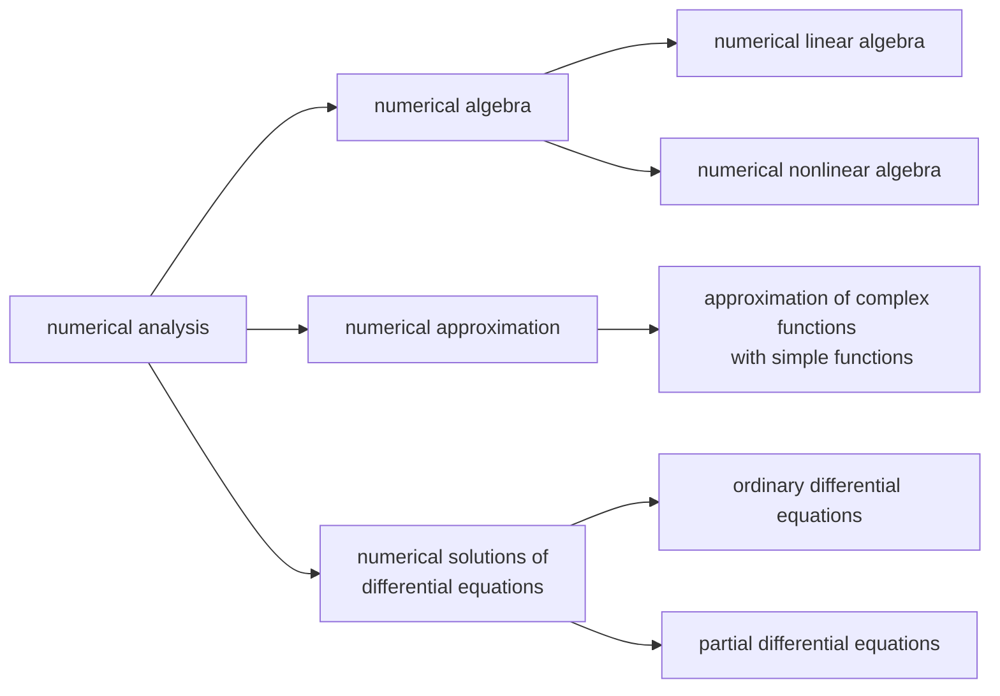

> This article was migrated from [Eureka10shen on 博客园]({{ page.original_url }}). The original publication date was 2022-09-19.

---

# C1 - Introduction

## 1.1 - Outline
performance of a numerical algorithm : convergence, stability, complexity  

## 1.2 - Errors
__absolute error__ : $e_ {x} \equiv \vert a - x\vert $, where $a$ denotes the approximation of $x$  
absolute error bound : $\varepsilon = \min\{0.5\times10^m \vert  e_ {x}<0.5\times10^m, \forall m\in\mathbb{Z}\}$  
__relative error__ : $\varepsilon_ {x} \equiv e_ {x}/\vert x\vert  = \vert a - x\vert /\vert x\vert $  

__`Definition 1.1`__ __significant digit__ : number of digits $n$ from the first non-zero digit to $m$ or the last digit  
for any non-zero value, we can rewrite it to  

$$

a = 0.a_1a_2...a_k \times 10^l, a_1 \neq 0

$$

  
with $\varepsilon = 0.5\times10^m$, the significant digit is  

$$

n = \begin{cases}
k, & m<l-k, &(l \leq k) \\
l, & m<0, &(l>k)\\
l-m, & l-k \leq m \leq l, &(l \leq k) \\
l-m, & 0 \leq m \leq l, &(l>k) \\
0, & m>l \\
\end{cases}

$$

$\diamondsuit$ errors of function approximation  

$$

x_i - a_i = e_i, |x_i-a_i|\leq\varepsilon_i

$$

$$

f(x_1, x_2, ...) \approx f(a_1, a_2, ...) + \sum_i\frac{\partial f(a_1, a_2, ...)}{\partial x_i} e_i

$$

$$

e(\tilde{u}) = u - \tilde{u} \approx \sum_i\frac{\partial f(a_1, a_2, ...)}{\partial x_i} e_i

$$

## 1.3 - Norms
__`Definition 1.2`__ __vector norm__ $\Vert\cdot\Vert$ on $\mathbb{C}^n$ : $\forall$ real-value function $\Vert\cdot\Vert$ on $\mathbb{C}^n$ which satisfy  
>(1) nonnegativity : $\forall x\in\mathbb{C}^n\rightarrow\Vert x\Vert\geq 0$, $\Vert x\Vert=0 \leftrightarrow x=0$  
(2) homogeneity : $\forall k\in\mathbb{C},x\in\mathbb{C}^n\rightarrow\Vert kx\Vert=\vert k\vert \cdot\Vert x\Vert$  
(3) triangle inequality : $\forall x,y\in\mathbb{C}^n \rightarrow \Vert x+y\Vert \leq \Vert x\Vert + \Vert y\Vert$

__`Lemma 1.1`__ Holder inequality  

$$

\sum_{i=1}^n a_ib_i \leq \left(\sum_{i=1}^n |a_i|^p\right)^\frac{1}{p} 
\left(\sum_{i=1}^n |b_i|^q\right)^\frac{1}{q}, \frac{1}{p} + \frac{1}{q} = 1

$$

  
__`Theorem 1.1`__ $\forall p\geq 1$, $\Vert x\Vert_ {p} = (\sum_ {i=1}^n \vert x_ {i}\vert ^p)^{1/p}$ is a vector norm on $\mathbb{C}^n$  
_`Proof`_ : proves for nonnegativity and homogeneity are omitted  

$$

\begin{align*}
\Vert x+y\Vert_p^p &= \sum_{i=1}^n |x_i+y_i|^p \\
&= \sum_{i=1}^n |x_i+y_i| \cdot |x_i+y_i|^{p-1} \\
&\leq \sum_{i=1}^n (|x_i|+|y_i|) \cdot |x_i+y_i|^{p-1}\\
&= \sum_{i=1}^n |x_i| \cdot |x_i+y_i|^{p-1} + \sum_{i=1}^n |y_i| \cdot |x_i+y_i|^{p-1}\\
&\leq \left(\sum_{i=1}^n |x_i|^p\right)^\frac{1}{p} \left(\sum_{i=1}^n |x_i+y_i|^{(p-1)q}\right)^\frac{1}{q} + \left(\sum_{i=1}^n |y_i|^p\right)^\frac{1}{p} \left(\sum_{i=1}^n |x_i+y_i|^{(p-1)q}\right)^\frac{1}{q} \\
&= (\Vert x\Vert_p + \Vert y\Vert_p) \Vert x+y\Vert_p^{p-1}
\end{align*}

$$

  

$$

x+y \neq 0 \Rightarrow \Vert x+y\Vert_p \leq \Vert x\Vert_p + \Vert y\Vert_p

$$

$$

x+y = 0 \Rightarrow \Vert x+y\Vert_p = 0 \leq \Vert x\Vert_p + \Vert y\Vert_p

$$

$\heartsuit$ typical vector norms :  
_1-norm_  

$$

\Vert x\Vert_1 = \sum_{i=1}^n |x_i|

$$

_2-norm, Euclid norm_  

$$

\Vert x\Vert_2 = \left(\sum_{i=1}^n |x_i|^2\right)^\frac{1}{2}

$$

_$\infty$-norm_  

$$

\Vert x\Vert_\infty = \max_{1\leq i\leq n} |x_i|

$$

__`Definition 1.3`__ __matrix norm__ $\Vert\mathbf{A}\Vert$ on $\mathbb{C}^{n\times n}$ : $\forall$ real-value function $\Vert\mathbf{A}\Vert$ on $\mathbb{C}^{n\times n}$ which satisfy  
>(1) nonnegativity : $\forall\mathbf{A}\in\mathbb{C}^{n\times n}\rightarrow\Vert\mathbf{A}\Vert\geq 0$, $\Vert \mathbf{A}\Vert=0 \leftrightarrow \mathbf{A}=0$  
(2) homogeneity : $\forall k\in\mathbb{C}, \mathbf{A}\in\mathbb{C}^{n\times n} \rightarrow \Vert k\mathbf{A}\Vert=\vert k\vert \cdot\Vert \mathbf{A}\Vert$  
(3) triangle inequality : $\forall \mathbf{A},\mathbf{B}\in\mathbb{C}^{n\times n} \rightarrow \Vert\mathbf{A}+\mathbf{B}\Vert \leq \Vert\mathbf{A}\Vert + \Vert\mathbf{B}\Vert$  
(4) compatible inequality : $\forall \mathbf{A},\mathbf{B}\in\mathbb{C}^{n\times n} \rightarrow \Vert\mathbf{AB}\Vert \leq \Vert\mathbf{A}\Vert \cdot \Vert\mathbf{B}\Vert$  

$\spadesuit$ typical matrix norms :  
_1-norm, column norm_  

$$

\Vert\mathbf{A}\Vert_1 = \max_{1\leq j\leq n} \sum_{i=1}^n |a_{ij}|

$$

_2-norm, spectral norm_  

$$

\Vert\mathbf{A}\Vert_2 = \sqrt{\lambda_{\max}(\mathbf{A}^\dagger\mathbf{A})}

$$

_$\infty$-norm, row norm_  

$$

\Vert\mathbf{A}\Vert_\infty = \max_{1\leq i\leq n} \sum_{i=1}^n |a_{ij}|

$$

_Frobenius norm, Euclid norm_  

$$

\Vert\mathbf{A}\Vert_F = \sqrt{\sum_{i,j=1}^n |a_{ij}|^2}

$$

__`Definition 1.4`__ __compatibility__ : $\forall\mathbf{A}\in\mathbb{C}^{n\times n}$, $\forall x\in\mathbb{C}^n$, if $\Vert\mathbf{A}x\Vert \leq \Vert\mathbf{A}\Vert \cdot \Vert x\Vert$, then they are compatible

__`Theorem 1.2`__ $\forall\Vert x\Vert$ on $\mathbb{C}^n$, $\exists\Vert\mathbf{A}\Vert$ on $\mathbb{C}^{n\times n}$ s.t. they are compatible and _vice versa_  
_`Proof`_ : define a function on $\mathbb{C}^{n\times n}$  

$$

\Vert\mathbf{A}\Vert = \max_{\Vert x\Vert=1} \Vert\mathbf{A}x\Vert

$$

  
we will prove that the function is a matrix norm (__operator norm__) and it is compatible with all $\Vert x\Vert$ on $\mathbb{C}^n$  
proves for nonnegativity, homogeneity and triangle inequality are omitted  
compatibility between matrix norms $\Rightarrow$  

$$

\begin{align*}
\Vert\mathbf{AB}\Vert &= \max_{\Vert x\Vert=1}\Vert(\mathbf{AB})x\Vert \\
&= \max_{\Vert x\Vert=1}\Vert\mathbf{A(B}x)\Vert \\
&\leq \max_{\Vert x\Vert=1}\Vert\mathbf{A\Vert\Vert B}x\Vert \\
&= \Vert\mathbf{A}\Vert \Vert\mathbf{B}\Vert
\end{align*}

$$

compatibility between matrix norm and vector norm $\Rightarrow$  

$$

x=0 \Rightarrow \Vert\mathbf{A}x\Vert =0= \Vert\mathbf{A}\Vert \cdot \Vert x\Vert

$$

$$

x\neq 0 \Rightarrow \Vert\mathbf{A}x\Vert = \Vert x\Vert \Vert\mathbf{A}\frac{x}{\Vert x\Vert}\Vert 
\leq \Vert x\Vert \max_{\Vert y\Vert=1}\Vert\mathbf{A}y\Vert = \Vert\mathbf{A}\Vert \cdot \Vert x\Vert

$$

__`Theorem 1.3`__ matrix p-norm is the _operator norm_ of vector p-norm  

$$

\Vert\mathbf{A}\Vert_1 := \max_{1\leq j\leq n} \sum_{i=1}^n |a_{ij}| = \max_{\Vert x\Vert_1=1} \Vert\mathbf{A}x\Vert_1

$$

$$

\Vert\mathbf{A}\Vert_2 := \sqrt{\lambda_{\max}(\mathbf{A}^\dagger\mathbf{A})} = \max_{\Vert x\Vert_2=1} \Vert\mathbf{A}x\Vert_2

$$

$$

\Vert\mathbf{A}\Vert_\infty := \max_{1\leq i\leq n} \sum_{i=1}^n |a_{ij}| = \max_{\Vert x\Vert_\infty=1} \Vert\mathbf{A}x\Vert_\infty

$$

_`Proof`_ : (for 1-norm)  
denote that $\mathbf{A} = [A_ {1}, A_ {2}, ..., A_ {n}]$, we have  

$$

\Vert x\Vert_1 = \sum_{i=1}^n |x_i| = 1

$$

$$

\Vert\mathbf{A}x\Vert_1 = \Vert\sum_{j=1}^n x_jA_j\Vert_1 
\leq \sum_{j=1}^n \Vert x_jA_j\Vert_1 = \sum_{j=1}^n |x_j| \cdot \Vert A_j\Vert_1
\leq \left(\sum_{j=1}^n |x_j|\right) \max_{1\leq j\leq n}\Vert A_j\Vert_1
= \max_{1\leq j\leq n} \sum_{i=1}^n |a_{ij}|

$$

$$

\Rightarrow \max_{\Vert x\Vert_1=1} \Vert\mathbf{A}x\Vert_1 \leq \max_{1\leq j\leq n} \sum_{i=1}^n |a_{ij}|

$$

$$

\max_{\Vert x\Vert_1=1} \Vert\mathbf{A}x\Vert_1 \geq \Vert\mathbf{A}e_k\Vert_1 = \Vert A_k\Vert_1 := \max_{1\leq j\leq n}\Vert A_j\Vert_1, e_k = [0, ..., 0, 1_k, 0, ..., 0]^\top

$$

$$

\Rightarrow \max_{\Vert x\Vert_1=1} \Vert\mathbf{A}x\Vert_1 \geq \max_{1\leq j\leq n} \sum_{i=1}^n |a_{ij}|

$$

$\clubsuit$ properties of matrix norm  
__`Theorem 1.4`__ all operator norm of identity matrix $\mathbf{I}$ equals to 1  

__`Theorem 1.5`__ if $\mathbf{A}$ is an invertible matrix, then for all operator norm $\Vert\mathbf{A}^{-1}\Vert\geq 1/\Vert\mathbf{A}\Vert$  

__`Theorem 1.6`__ if $\Vert\mathbf{A}\Vert\leq 1$, then $\mathbf{I\pm A}$ is not singular, and  

$$

\Vert(\mathbf{I}\pm\mathbf{A})^{-1}\Vert \leq \frac{\Vert\mathbf{I}\Vert}{1-\Vert\mathbf{A}\Vert}

$$

  
_`Proof`_ : if $\mathbf{I\pm A}$ is singular, then $\exists x\in\mathbb{C}^n\neq 0$ s.t.  

$$

(\mathbf{I}\pm\mathbf{A})x = 0 \iff x = \mp\mathbf{A}x \Rightarrow \Vert x\Vert = \Vert\mathbf{A}x\Vert \leq \Vert\mathbf{A}\Vert\cdot\Vert x\Vert \Rightarrow \Vert\mathbf{A}\Vert \geq 1

$$

there exists a contradiction  

$$

(\mathbf{I}\pm\mathbf{A})(\mathbf{I}\pm\mathbf{A})^{-1} = \mathbf{I} \Rightarrow 
(\mathbf{I}\pm\mathbf{A})^{-1} = \mathbf{I} \mp \mathbf{A}(\mathbf{I}\pm\mathbf{A})^{-1}

$$

$$

\Vert(\mathbf{I}\pm\mathbf{A})^{-1}\Vert 
= \Vert\mathbf{I} \mp \mathbf{A}(\mathbf{I}\pm\mathbf{A})^{-1}\Vert 
\leq \Vert\mathbf{I}\Vert + \Vert\mathbf{A}(\mathbf{I}\pm\mathbf{A})^{-1}\Vert
\leq \Vert\mathbf{I}\Vert + \Vert\mathbf{A}\Vert \cdot \Vert(\mathbf{I}\pm\mathbf{A})^{-1}\Vert

$$

$$

(1-\Vert\mathbf{A}\Vert) \Vert(\mathbf{I}\pm\mathbf{A})^{-1}\Vert \leq \Vert\mathbf{I}\Vert

$$

$$

\Vert(\mathbf{I}\pm\mathbf{A})^{-1}\Vert \leq \frac{\Vert\mathbf{I}\Vert}{1-\Vert\mathbf{A}\Vert}

$$

---

# C2 - Solutions for Linear Systems

## 2.1 - Gaussian elimination
considering the linear system  

$$

\mathbf{A}\mathbf{x} = \mathbf{b}

$$

$$

\begin{cases}
a_{11}x_1 + a_{12}x_2 + ... + a_{1n}x_n = b_1 \\
a_{21}x_1 + a_{22}x_2 + ... + a_{2n}x_n = b_2 \\
\cdots \\
a_{n1}x_1 + a_{n2}x_2 + ... + a_{nn}x_n = b_n
\end{cases}

$$

in the $k$-th elimination, we have the augmented matrix  

$$

\begin{bmatrix}
a_{11}^{(1)} & \cdots & a_{1,k-1}^{(1)} & a_{1k}^{(1)} & & \cdots & & a_{1n}^{(1)} & b_{1}^{(1)} \\
\vdots & \ddots & \vdots & \vdots & & \ddots & & \vdots & \vdots \\
0 & \cdots & a_{k-1,k-1}^{(k-1)} & a_{k-1,k}^{(k-1)} & & \cdots & & a_{k-1,n}^{(k-1)} & b_{k-1}^{(k-1)} \\
& & & a_{kk}^{(k)} & \cdots & a_{kj}^{(k)} & \cdots & a_{kn}^{(k)} & b_{k}^{(k)} \\
& & & \vdots & & & & \vdots & \vdots \\
& & & a_{ik}^{(k)} & \cdots & a_{ij}^{(k)} & \cdots & a_{in}^{(k)} & b_{i}^{(k)} \\
& & & \vdots & & & & \vdots & \vdots \\
& & & a_{nk}^{(k)} & \cdots & a_{nj}^{(k)} & \cdots & a_{nn}^{(k)} & b_{n}^{(k)} \\
\end{bmatrix}

$$

make the row transformation  

$$

(i) \leftarrow (i) - \frac{a_{ik}^{(k)}}{a_{kk}^{(k)}}\cdot(k), i = k+1,k+2,...,n

$$

$$

a_{ij}^{(k+1)} = a_{ij}^{(k)} - \frac{a_{ik}^{(k)}}{a_{kk}^{(k)}} \cdot a_{kj}^{(k)}

$$

$$

b_{i}^{(k+1)} = b_{i}^{(k)} - \frac{a_{ik}^{(k)}}{a_{kk}^{(k)}} \cdot b_{k}^{(k)}

$$

note that the pivot element $a_ {kk}^{(k)}$ should not be $0$  
in the backward substitution, we have  

$$

x_n = \frac{b_n^{(n)}}{a_{nn}^{(n)}}

$$

$$

x_k = \frac{b_k^{(k)} - \sum_{j=k+1}^n a_{kj}^{(k)}x_j}{a_{nn}^{(n)}}, k=n-1,n-2,...,1

$$

__`Theorem 2.1`__ condition for $a_ {kk}^{(k)} \neq 0$ $(\forall k=1,2,...,n-1)$ :   

$$

a_{kk}^{(k)} \neq 0 \iff D_k = \begin{vmatrix}
a_{11}^{(1)} & \cdots & a_{1k}^{(1)} \\
\vdots & \ddots & \vdots \\
a_{k1}^{(1)} & \cdots & a_{kk}^{(1)} \\
\end{vmatrix} \neq 0

$$

__improvement__ : column pivot element Gaussian elimination  
(1) in the $k$-th elimination, find the maximum pivot element  

$$

\left|a_{i_kk}^{(k)}\right| = \max_{i = k,k+1,...,n} \left|a_{ik}^{(k)}\right|

$$

(2) exchange the $k$-th row with the $i_ {k}$-th row  
__`Theorem 2.2`__ the coefficient matrix $\mathbf{A}$ is invertible $\iff$ pivot elements of the __improvement__ are all non-zero
